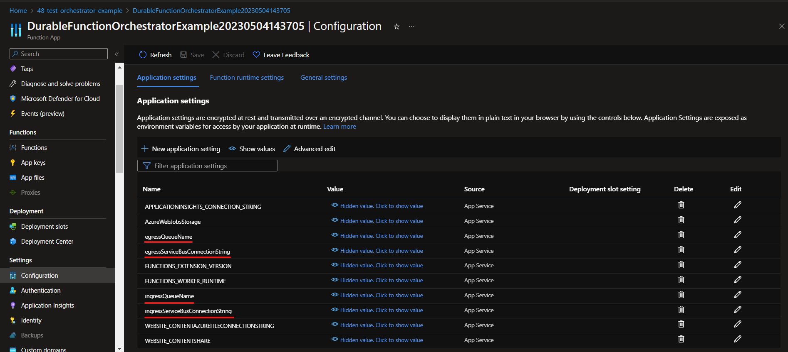
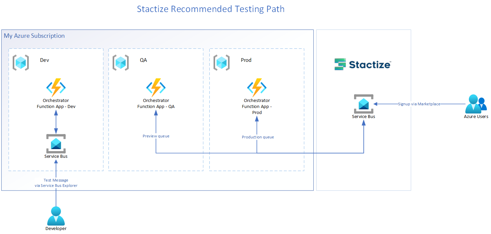

# Introduction

This repository contains example implementations of orchestrators that will consume messages from Stactize and send a response back.
The current example orchestrator implementations are:
- Durable Function Orchestrator - suitable for orchestrations that are *more complex* and which any individual orchestration task could take *more than 15 minutes* to complete.
- Standard Function Orchestrator - suitable for orchestrations that are simpler and which any individual orchestration task could take *less than 15 minutes* to complete.

## What is an Orchestrator?
An orchestrator is required to receive these messages, take any action required to fulfil the Event (such as updating a configuration or spinning up a new resource), and finally respond to Stactize via a service bus message posted to the Egress queue.

Stactize will enqueue messages to your Ingress queue whenever a subscriber takes an action from the Azure marketplace. The message contains a JSON-formatted string that contains the information required to fulfil any action. These actions contain an Event parameter, which describes an action a user has taken:
| Event     | Description                                               |
| --        | --                                                        | 
| Create    | User has signed up to your product via the marketplace    |
| Update    | User has changed their plan or the number of seats        | 
| Suspend   | User has failed to pay for the billing term               | 
| Reinstate | User has resolved their billing issues                    | 
| Delete    | User has cancelled their subscription                     | 

An orchestrator can be any application that can receive and send messages via the AMQP 1.0 protocol. Connections can be achieved using [supported client libraries](https://learn.microsoft.com/en-us/azure/service-bus-messaging/service-bus-messaging-overview#client-libraries) that exist for multiple languages, using [direct integrations](https://learn.microsoft.com/en-us/azure/service-bus-messaging/service-bus-messaging-overview#integration) with Microsoft and Azure-native services or using the [Service Bus SDK](https://learn.microsoft.com/en-us/azure/service-bus-messaging/service-bus-samples), which is also available for multiple platforms.  

# Getting Started

The Durable Function Orchestrator is designed around Azure Durable Functions, which are a special type of Azure Function that allow for a stateful workflow and support for longer lived functions. More information about Durable Functions can be found at https://docs.microsoft.com/en-us/azure/azure-functions/durable/durable-functions-overview?tabs=csharp.

---

## 1. Prerequisites
In order to build and test the Durable Function Orchestrator Example, you must have the following software installed:

 1. NET 8 SDK
 2. Azure Functions Core Tools

Visual Studio Code and Visual Studio 2022 support development for .NET 8 Durable Functions. You can see [Microsoft's Guide on creating a durable function](https://docs.microsoft.com/en-us/azure/azure-functions/durable/durable-functions-create-first-csharp?pivots=code-editor-vscode) for more information.

---

## 2.1. Understanding the Durable Function Orchestrator
There are three parts to the durable orchestrator: 
1. A service bus queue trigger 
2. An Orchestrator Run method
3. Activity Functions

When a message is placed on your ingress queue, the `TriggerOrchestrator` function will run. This function is responsible for starting the Durable Orchestrator. You can also use this function for data validation and early message rejection. 

> Note: If an exception is thrown while processing the message, it will be placed back on the queue for re-processing. This will happen ten times before dead-lettering. If you do not want this functionality, you should catch the exception and abandon the message.

The Durable Orchestrator is started by calling the `ScheduleNewOrchestrationInstanceAsync` method on the `DurableTaskClient`. This will run the `RunOrchestrator` method.

In the example, the `RunOrchestrator` method determines which activity to call based on the `SubscriptionEvent` that is present on the incoming `OrchestrationActionModel`. This allows the Durable Orchestrator to call another function and keep its state by awaiting a `CallActivityAsync` call. This can easily be extended to accommodate more complicated scenarios by adding any required activity functions and awaiting them. Please see the tutorials for [Function Chaining](https://docs.microsoft.com/en-us/azure/azure-functions/durable/durable-functions-sequence?tabs=csharp), [Fan-out/Fan-in](https://docs.microsoft.com/en-us/azure/azure-functions/durable/durable-functions-cloud-backup?tabs=csharp), and [Human verification](https://docs.microsoft.com/en-us/azure/azure-functions/durable/durable-functions-phone-verification?tabs=csharp) for some examples of how to leverage durable functions.

Once the activity function has completed the orchestration action, the orchestrator needs to send a response back to Stactize. This response is expected to be of type `OrchestrationResultModel`. The returned result can either be a successful result (`OrchestrationState = Succeeded`) or an unsuccessful result (`OrchestrationState = Failed`). If any exception occurs in the orchestration or if there is a process that fails that will completely halt the orchestration, you should send a result back to Stactize to notify the user or an administrator (depending on the orchestration action and your application's configuration in the Stactize portal).

## 2.2 Understanding the Standard Function Orchestrator
The Standard Function Orchestrator is constructed similarly to the Durable Function Orchestrator except it only relies on the standard Azure Function Runtime to consume messages from Stactize. For orchestration, this means that the entire function must execute in less than 15 minutes.

The `Run()` method will be triggered when a message is placed on the `Ingress Queue`. This method will then deserialize the message body into an `OrchestrationActionModel` and determine the correct method to execute based on the `SubscriptionEvent`. These activity methods can be updated to execute any appropriate orchestration actions for your application. 

Each activity method returns an `OrchestrationResultModel`, constructed from the incoming `OrchestrationActionModel`. This result is then sent to the `Egress Queue` for Stactize to process. If any exceptions occur, the exception is caught and an `OrchestrationResultModel` is created with a failure state and a supplied error message. This result is also sent to Stactize for processing and can be retried from the Stactize portal.

### Emails sent by Stactize
Stactize sends various emails after actions have been consumed and returned to the `Egress Queue`. Emails are sent to the following people according to whether the result is a success or not: 
| Action   | Success*   | Failure      | 
| --       | --         | --           |
| Create   | User       | User & Admin |
| Update   | User       | User & Admin |
| Suspend  | User       | Admin        |
| Reinstate| User       | Admin        |
| Delete   | User       | Admin        |

> **\*** The Stactize portal allows you to configure your applications so that all emails sent to users will **also** be sent to an admin.

---

## 3. Adding your own orchestration code
In the `DurableFunctionOrchestrator` class, there are five activities that are triggered based on the `SubscriptionEvent` that is received by the durable orchestrator function. These activities are:

 1. `CreateInfrastructure`
 2. `DeleteInfrastructure`
 3. `Reinstate`
 4. `Suspend`
 5. `Update`

Add all the code required to execute the operation.
It is important to note that Stactize expects a response for all actions initiated - even if they fail. This is why each of these activity functions return a `OrchestrationResultModel`. If an exception is thrown inside the activity, it is recommended to catch the exception and return a default result model with the status set to failed (`OrchestrationState = Failed`).

### 3.1. Configuration
The Durable Function Orchestrator requires four parameters to be defined:
| Parameter                         | Description                                                                                                                                                       |
| --                                | --                                                                                                                                                                | 
| ingressServiceBusConnectionString | The connection string to the Ingress Service Bus that Stactize will place actions for the orchestrator to fulfil. Stactize exposes a read-only connection string. |
| ingressQueueName                  | The name of the queue that will have incoming actions from Stactize                                                                                               | 
| egressServiceBusConnectionString  | The connection string to the Egress Service bus that Stactize will read orchestration results from. Stactize exposes a write-only connection string.              | 
| egressQueueName                   | The name of the queue that Stactize will read the orchestration result from                                                                                       | 

When running locally, you can update the `local.appsettings.json` file to configure these values. See the [Local Testing Section](#4-testing-your-orchestrator) for more information about what values to use for the configurations. To protect connection strings, the `local.appsettings.json` will not be bundled with the app when building with the Release configuration.

When deployed to Azure, the function will pull the configuration from the Application Settings setup in the Azure Portal.


For the most secure deployment, you can store the connection strings in a Key Vault and configure the Azure Function to use [Key Vault secret references](https://learn.microsoft.com/en-us/azure/app-service/app-service-key-vault-references?tabs=azure-cli) 

### 3.2. Action Details
Each action type can come with more information that is specific to the action. This is stored as a dictionary of Key/Value strings in the `ActionDetails` property of the `OrchestrationActionModel`.

> Note: The `ActionDetails` dictionary values are always strings and must be parsed into their expected types.

#### 3.2.1 Create Action Details
When handling the Create action, the following keys could appear in the `ActionDetails` dictionary:
- AutoRenew - A boolean describing whether the subscription has auto renew enabled. If this is false, the Subscription will be cancelled at the end of the billing period.
- IsFreeTrial - A boolean describing whether the subscription is in free trial. If this is true, Billing for this subscription will only start on the following billing period.
- Quantity - If the offer has been configured to use seat-based billing, this integer will describe the number of seats the purchaser has selected for this subscription. This key _will not appear_ in the dictionary if the offer is not configured for seat-based billing.

*Example:*
```
"ActionDetails": 
{
    "AutoRenew" : "True",
    "IsFreeTrial" : "False",
    "Quantity": "10"
}
``` 

#### 3.2.2 Update Action Details
When handling the Update action, the following keys could appear in the `ActionDetails` dictionary:
- NewQuantity - If the offer has been configured to use seat-based billing, this integer will describe the number of seats the purchaser has selected when updating their subscription.

> Note: Plan changes and quantity changes must both be taken into account when handling an update action.

*Example:*
```
"ActionDetails": 
{
    "NewQuantity": "25"
}
```

### 3.3. Seat-based billing
If your offer has been setup to use seat-based billing, Stactize will send the number of elected seats in the `ActionDetails` property of the `OrchestrationActionModel`. 

When receiving a `Create` action, the number of seats can be retrieved from the `Quantity` key in the `ActionDetails` dictionary. See the `Action Details` section for an example of this dictionary.
```
if (OrchestrationActionModel.ActionDetails.ContainsKey("Quantity"))
{
    int.TryParse(OrchestrationActionModel.ActionDetails["Quantity"], out var numberOfSeats); 
    //Set the number of seats in your application
}
```

A user can change the number of seats. When this happens, the `Update` action will have an `ActionDetails` dictionary with a `NewQuantity` key.
```
if (OrchestrationActionModel.ActionDetails.ContainsKey("NewQuantity"))
{
    int.TryParse(OrchestrationActionModel.ActionDetails["NewQuantity"], out var newNumberOfSeats); 
    //Update the number of seats in your application to the new value
}
```

### 3.4. Metered billing
Stactize supports metered billing but this is handled outside of orchestration using a set of APIs. Please contact support@1Nebula.com for more information on how to handle metered billing with Stactize.

---

## 4. Testing your orchestrator


### 4.1 Local testing
Stactize does not currently support enqueueing test messages. To test your orchestration locally, create a Service Bus Namespace in your Azure account via the Azure Portal with two queues, named `ingressTest` and `egressTest`. The default queue configuration is acceptable. 
[Find the connection](https://azurelessons.com/azure-service-bus-connection-string/) string for the Service Bus by navigating to the Shared Access Policies section in the Service Bus Namespace in the Azure Portal. Update the `local.settings.json` and set both the `ingressServiceBusConnectionString` and `egressServiceBusConnectionString` connection strings to the connection string. Set the `ingressQueueName` property to `ingressTest` and the `egressQueueName` to `egressTest`. 

Run the app locally and use a tool such as [Service Bus Explorer](https://github.com/paolosalvatori/ServiceBusExplorer) to manually add test messages to the queue. Below is an example of a 'Create' event that should be sent to the `ingressTest` queue:

```
{
  "ActionDetails" : //See section 3.1. Action Details
  {
    "AutoRenew" : "True",
    "IsFreeTrial" : "False"
  },
  "ApplicationId": "b48463a8-1811-4c23-9f75-a6825c29f71c", //Id of Application in Stactize
  "OperationId": "a1a644f5-efdf-43f3-b98e-01c5b55a6a98", //Id of the Operation
  "TenantId": "bd622fe3-ea28-42e9-ad12-56b5be8536c1", //Id of the Tenant requesting the action
  "SubscriptionId": "7d8e2ac6-80ce-4568-8063-a862081701e1", //Id of the Subscription requesting the action
  "PlanId": "planId", //Id of the plan chosen by the subscriber
  "Event": "Create",
  "UserFields": [
    {
      "Name": "FirstName",
      "Value": "Robert"
    },
    {
      "Name": "LastName",
      "Value": "Tables"
    },
    {
      "Name": "Email",
      "Value": "signup@email.com"
    },
    {
      "Name": "PreferredContactEmail",
      "Value": ""
    }
  ]
}
```
> Note: The comments explaining fields will need to be removed in order for the orchestrator to process the message above as valid json.

### 4.2 End-to-end Testing
Once local testing is complete, you can test the entire integration between the Azure Marketplace, Stactize and your orchestrator. To do this, ensure the following prerequisites have been completed:

#### Prerequisites
1. A SaaS offer setup in the Microsoft Partner Center
2. Your SaaS application set up in Stactize
3. Technical configuration setup correctly in the Microsoft Partner Center
4. The SaaS offer at least in Preview
5. Your Orchestrator Ingress and Egress queues setup correctly based on the Stactize Orchestrator Configuration for your application
 
> Note:  We recommend creating a zero-cost private plan that is only visible to members of your company for testing purposes.

You can then configure your Orchestrator to use the ingress and egress queues specified by the `Orchestrator Configuration` found in the Stactize portal. If your Orchestrator is deployed to Azure, ensure the *ingressServiceBusConnectionString*, *ingressQueueName*, *egressServiceBusConnectionString* and *egressQueueName* [application settings](https://docs.microsoft.com/en-us/azure/azure-functions/functions-how-to-use-azure-function-app-settings?tabs=portal#settings) have been setup in the Portal.

With the prerequisites completed, you can then search for your application in the Marketplace and purchase it. Stactize should send a "Create" message to your application's `Ingress Queue`. If you purchase a "Preview" offer, the message will be sent to the "Preview" queue, otherwise it will be sent to the "Production" queue. The subscription can then be updated and cancelled to test the other events. If you subscribe to a non-zero cost plan, you will not be charged for the subscription if you cancel it before 24 hours for a monthly billed plan or 14 days for a yearly billed plan.

Durable Functions deployed into Azure can be monitored by using the [Durable Functions Monitor](https://marketplace.visualstudio.com/items?itemName=DurableFunctionsMonitor.durablefunctionsmonitor) Visual Studio Code extension.

---

## 5. Support
Please don't hesitate to send an email to support@1Nebula.com for more information or to answer any questions.